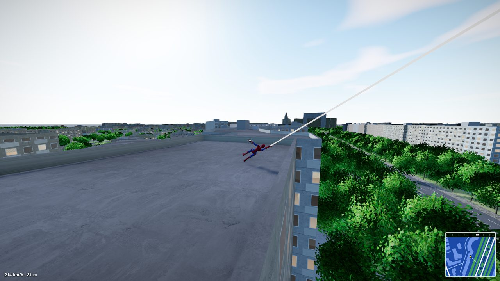
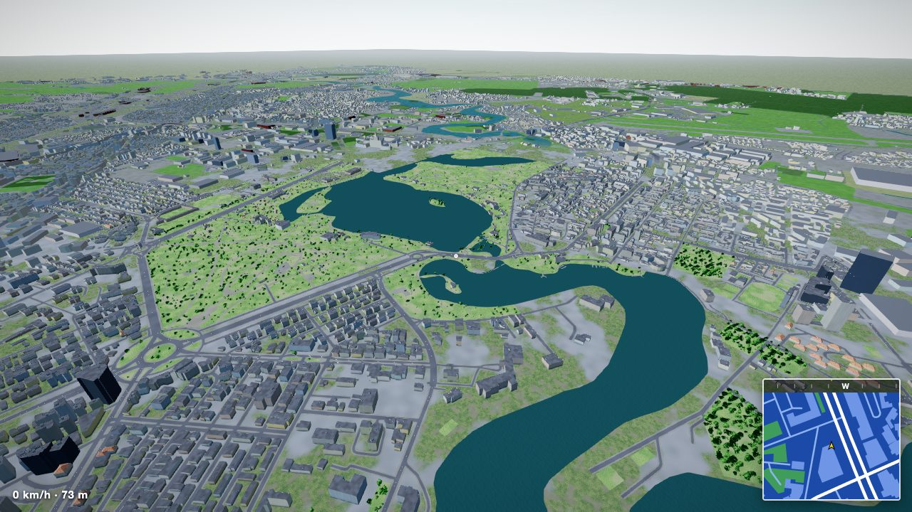
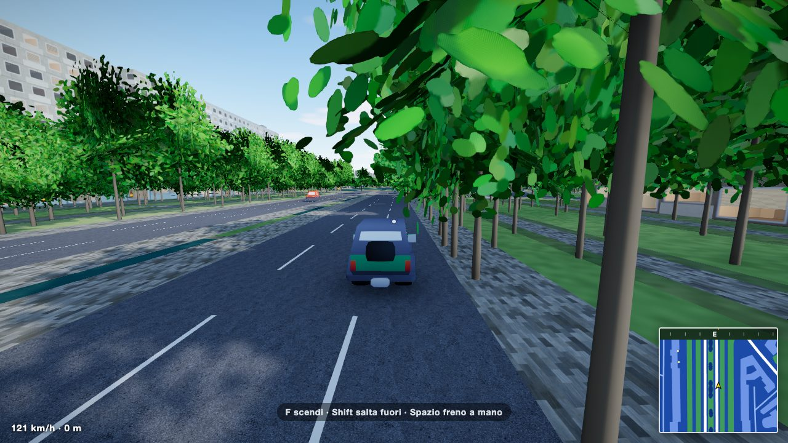
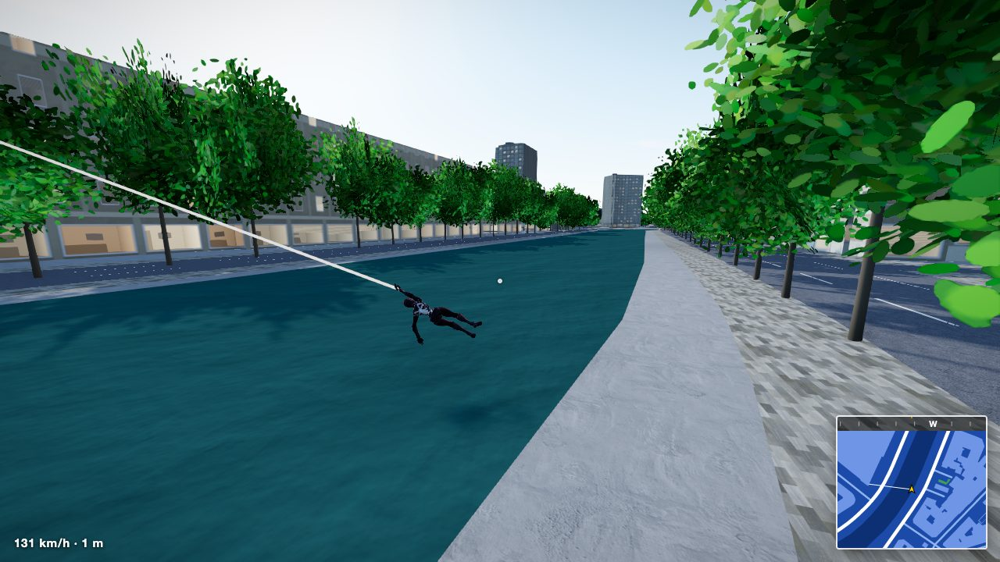
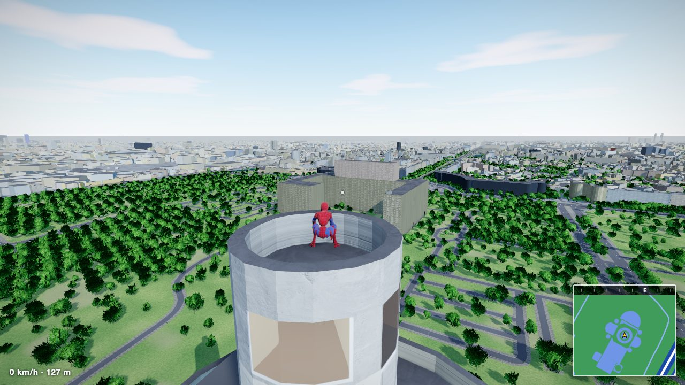
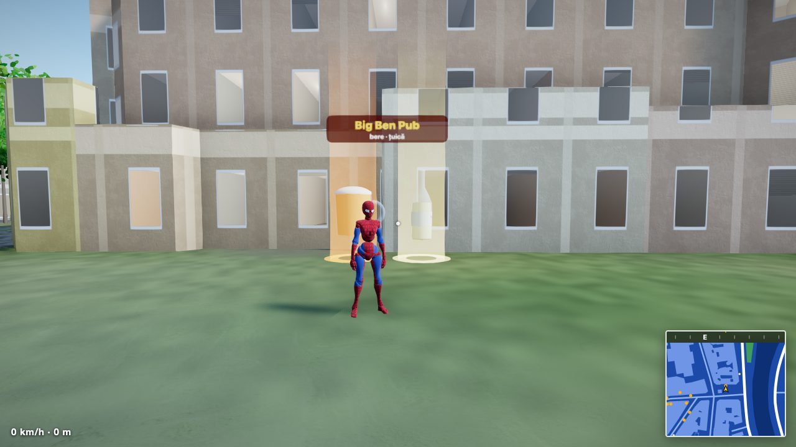
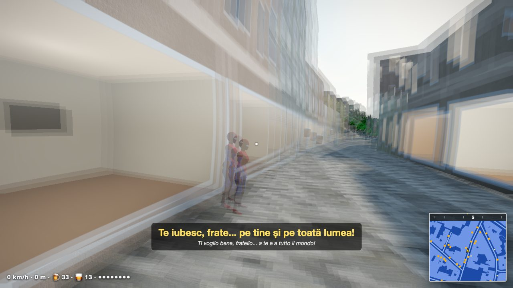

# Web Swing: Bucarest

A web-swinging game in the browser over the real Bucharest, rebuilt from the OHMO.AI reel and then taken further: the whole city from OpenStreetMap, traffic you can steal, and bars where you can drink beer or țuică. three.js, runs locally.



| | |
|---|---|
|  |  |
| The north of the city, from Herăstrău to the lakes | Any car in traffic can be stolen (F) |
|  |  |
| Swinging along the Dâmbovița | A tower roof over the parks |
|  |  |
| A beer and a țuică outside a real bar | Double vision, and a line in Romanian with an Italian subtitle |

Status: the hero is still the Spider-Man rig. The next round replaces it with Bunica, adds fights, crimes, police and missions, and a second city (Brașov, with its real hills). The design is in `docs/specs/2026-09-29-gameplay-design.md`.

| | |
|---|---|
| Play | `npm run play` (builds, serves on http://127.0.0.1:5178/ and opens the browser) |
| Demo (autopilot) | http://127.0.0.1:5178/?demo |
| Tests | `node test/physics.mjs`: 12 scripted checks in headless Chromium, exit code 1 on failure. `node test/core.mjs`: the foundation (systems, events, save, hud, map selection). `node test/respect.mjs`, `test/missions.mjs`, `test/challenges.mjs`: levels and buffs, the nine missions, races, jars and PET bonuses (`node test/missionshots.mjs` takes the screenshots of them). `PORT=n` picks the test server port |
| Videos | `node test/showcase.mjs` → `shots/showcase.mp4`; `node test/record.mjs 30` → `shots/preview.mp4` |
| Frame rate | `node test/perf.mjs demo 30` (real-time, on the GPU) |

## Controls

| Key | Action |
|---|---|
| Mouse | look (click to capture the pointer, Esc to pause) |
| W A S D | run, steer while swinging, climb walls; drive a car |
| Shift or left click, held | web and swing; hold to chain swings. In a car: jump out and swing |
| Space | jump, jump off a wall, release a swing with a boost. In a car: handbrake |
| E or right click | zip to the point under the crosshair |
| F | steal the car next to you, or get out |
| 1 to 9, 0 | Piața Unirii, Parliament, Ateneu, Piața Victoriei, Arcul de Triumf, Herăstrău, Sky Tower, Casa Presei, Arena Națională, Drumul Taberei |
| V, M, R | suit, minimap zoom, back to the start roof |
| G | begin the next mission (from within 45 m of its yellow marker, or walk into it); silence a speaker in the speaker mission |

Walk over the drinks in front of bars and kiosks (yellow dots on the minimap): a beer counts one, a țuică two, and it wears off in a few minutes. Stealing, drinking and crashing get a line in Romanian, with an Italian subtitle, spoken by the system's Romanian voice when there is one (Ioana on macOS).

## What is in it

| Area | How |
|---|---|
| City | 212,734 buildings, 65,736 road pieces, water, parks and 346,000 trees inside 44.33–44.54 N, 25.96–26.23 E; streamed in 400 m chunks within about 2 km, a box per building beyond that, and a land-use map of the whole city on the far ground |
| Heights | OSM `height` and levels first, then the median of tagged neighbours, then the footprint; tagging errors capped |
| Traffic | Up to 60 cars on the OSM roads around you, on the right-hand lane, turning where roads meet, queueing and stopping for you |
| Drinks | 1,925 real places: 295 bars and pubs (beer and țuică) and kiosks or non-stops (beer), each with its name on a sign |
| Movement | pendulum on an inelastic rope, anchors on building faces, wall crawl and vault, zip, water respawn |
| Rendering | CSM shadows, N8AO, ACES tone mapping, SMAA, interior-mapped windows, PBR ground, double vision when drunk |

URL flags: `?lowq` for weaker GPUs, `?fps` for the frame rate, `?cars=N` for traffic density, `?spot=0..9` to start at a place, `?seed=N` for the random generator, `?city=<id>` to skip the map selection (`bucharest`, `brasov`, or `center` for the smaller centre-only build of Bucharest). `?demo` and `?shot=` open Bucharest without the selection.

## Architecture

| Piece | How |
|---|---|
| Map selection | a plain start shows a card per city (București, Brașov), each with a picture from the game (`public/ui/`, retaken with `node test/citycards.mjs <id>`). A card is a link to `?city=<id>`, so nothing is built before the choice; the last choice is saved. The pause screen has Cambia mappa |
| Cities | `?city=<id>` loads `public/city/<id>/` and `CITIES[id]` from `src/cities.js`: `label`, `tagline`, `image`, `cardView`, `spots` (number keys), `waypoints` (demo route), `spawnFacing`. Coordinates are x east, y up, z south, in metres from the origin in `index.json`. `city.cityId`, `city.origin` and `city.groundAt(x, z)` (0 on flat cities) are the per-city hooks |
| Systems | a system is `src/<name>.js` exporting `create(game)`, which returns `{ name, init?(), update(dt), onCityChange?(id), dispose?() }`. `src/systems-list.js` lists them one line each, `() => import('./name.js'),`, in update order. Once every system exists `init` runs, then `onCityChange` with the city, then `update` on each tick after the player, traffic and drinks and before drawing. One that throws is logged once and skipped. `game.systems.add(system)` and `remove(name)` do the same by hand, for tests |
| game | `scene camera renderer params cityId city player hero traffic drinks drunk voice input events actors hud save minimap sfx time rng systems`, also `window.__game` next to the test hooks (`advance`, `simulate`, `state`, `setInput`, `goTo`, ...). `time` is game seconds, `rng` is seeded (`?seed=N`), `actors` stays null until `src/actors.js` lands |
| Events | `game.events.on(name, fn)` returns the function that unsubscribes, `emit(name, payload)`. The core emits `car:stolen` and `city:change`; the systems emit the rest |
| Input | `game.input.state` adds `attackPressed` (left click or J), `throwPressed` (Q), `tiePressed` (C), `interactPressed` (G) and `pausePressed` (P) to the old fields. They only report, the systems decide what they mean |
| HUD | DOM over the canvas, text 13 px or more, nothing overlapping down to phone width. `hud.add(id, { order, render(el, game) })` or an element adds a panel (render runs about ten times a second), `hud.toast(text)`, `hud.setObjective(text or null)`. `minimap.setMarkers(owner, [{ x, z, color, shape: 'dot' or 'ring' or 'square', label? }])` replaces that owner's markers |
| Save | `game.save.get(key, fallback)` and `set(key, value)`, JSON under `webswing.v1` in localStorage, in memory when storage is blocked |
| Respect | `game.respect` `{ value, level 1..10, into, span, add(n, why) }` (saved under `respect`; a loss never goes under the start of the level reached) and `game.perks` `{ ropeLen, maxHp, throwCount, scarves }` unlocked by level. Missions, races, jars and PET bottles pay into it, so does a `crime:solved` event |
| Missions | `src/missions-data.js` lists the missions of each city (Bucharest "Pensia", 6; Brașov "Vacanță la Brașov", 3) as steps: `goto`, `deliver` (`race`), `defeat`, `tie`, `chase`, `steal`, `tail`, `destroy`, `escort`. `src/missions.js` runs them: yellow columns and minimap markers for the checkpoints, the objective and clock on the HUD, `game.missions` `{ list, active, start(id), abort(), timer }`, progress saved under `missions`, a failed run leaves nothing behind |
| Challenges | `src/challenges-data.js` has 5 races per city (6 in Brașov, with the downhill from Poiana) with gold, silver and bronze times, best times saved under `challenges`. 50 jars of zacusca per city, saved under `borcane`. `game.challenges` |
| PET bottles | six kinds (beer, wine, țuică, cola, water, juice), 20 per city, each with a glow in the colour of its content; `game.buffs` `{ add(name, s), has, left, active }` runs the 30 s bonuses (turbo, shield, fire, energy) and `game.pets`. Positions of jars and bottles: `node tools/make-collectibles.mjs <city>` writes `public/city/<id>/collect.json` (run it again after rebuilding a city) |

Event names and payloads: `hit {target, dmg, by}`, `actor:down {actor}`, `actor:tied {actor}`, `crime:start {id, kind, pos}`, `crime:end {id, result}`, `wanted {stars}`, `busted`, `respect {amount, why}`, `mission:start {id}`, `mission:end {id, result: 'done' or 'fail' or 'abort', why?}`, `challenge:start {id}`, `challenge:end {id, result, medal?, time?}`, `collect {kind: 'jar' or 'pet' or 'checkpoint', id, type?}`, `buff {name, seconds}`, `level:up {level}`, `car:stolen {car}`, `player:down`, `city:change {id}`.

## Rebuilding the city

```
curl -L -o data/pbf/romania.osm.pbf https://download.geofabrik.de/europe/romania-latest.osm.pbf
cd data/pbf
osmium extract -s smart -b 25.96,44.33,26.23,44.54 romania.osm.pbf -o buc.osm.pbf --overwrite
osmium tags-filter buc.osm.pbf nwr/building nwr/building:part w/highway nwr/natural nwr/waterway nwr/leisure nwr/landuse w/railway w/man_made=bridge nwr/amenity=bar,pub,biergarten,nightclub nwr/shop=alcohol,beverages,kiosk,convenience -o buc-f.osm.pbf --overwrite
osmium export buc-f.osm.pbf -c export.json -f geojsonseq -x print_record_separator=false -o buc.geojsonseq --overwrite
cd ../.. && node --max-old-space-size=12000 tools/osm-build.mjs bucharest data/pbf/buc.geojsonseq
```

`export.json` is `{ "attributes": { "type": true, "id": true } }`. The build takes about 10 seconds and writes `public/city/bucharest/`. `tools/osm-fetch.mjs` still works for small areas through Overpass.

## Credits

| Asset | Source and licence |
|---|---|
| Map data | © OpenStreetMap contributors, ODbL, via Geofabrik |
| Terrain (Brașov) | Copernicus DEM GLO-30, produced using Copernicus WorldDEM-30 © DLR e.V. 2010-2014 and © Airbus Defence and Space GmbH 2014-2018, provided under COPERNICUS by the European Union and ESA; all rights reserved |
| Cars | Kenney Car Kit, CC0 |
| Hero | Mixamo X Bot, from the three.js examples |
| Textures | ambientCG, CC0; water normals from the three.js examples |
